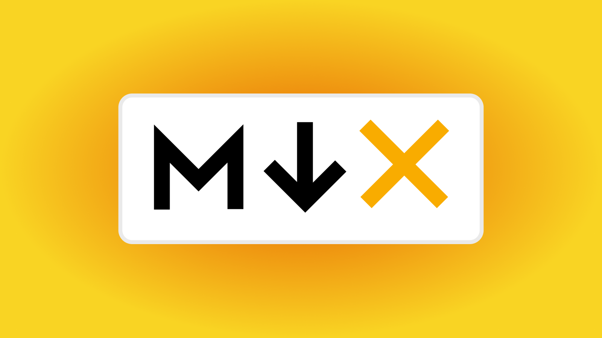

import Accordion from './Accordion.tsx';

[MDX](https://mdxjs.com/) is a great way to add unique elements, features, and interactive demos to blog posts. Typically, the visual elements of a blog post are restrained by the configured styles for typical HTML elements. For example, you might write a blog post in markdown and you're able to uniquely style the bold text, italicized text, heading text, and the embedded images (amongst other things), but what if you want to add a fancy accordion element to display content in a unique way? That's where MDX can come in handy.

<Accordion />
An example of a custom accordion element that can be added to a blog post with MDX.

## What is MDX?

MDX is markdown that can be mixed with JSX. JSX is often used to describe what the UI should look like in [React components](https://reactjs.org/docs/introducing-jsx.html). So what this means is that MDX allows you to embed React components into your markdown content. MDX has many useful applications, as illustrated by some popular libraries that currently make use of MDX, such as [docz](https://github.com/pedronauck/docz) (documentation framework based on MDX) and [mdx-deck](https://github.com/jxnblk/mdx-deck) (create presentation slides with MDX).

## Example usages

### Apollo documentation

The [Apollo GraphQL documentation site](https://www.apollographql.com/docs/) has really made good use of MDX for their documentation. Their documentation site is built with GatsbyJS and they built their [own GatsbyJS theme](https://github.com/apollographql/gatsby-theme-apollo) which exposes components that can be imported into their blog posts.

Here's a tweet by Trevor Blades, from Apollo, explaining an example usage of using a React component in their MDX to display an expanding panel of information:

https://twitter.com/trevorblades/status/1132168568739516416

### Kent C Dodds blog posts

[Kent C Dodds](https://kentcdodds.com) sometimes embeds some interactive demos into his blog posts to let readers test things out for themselves. You can see an example of this at the beginning of this blog post: ["When to useMemo and useCallback"](https://kentcdodds.com/blog/usememo-and-usecallback)

### My blog

Some of my own posts contain embedded React components, similar to what Kent C Dodds does. For example, the post "[Inspecting CSS Styles of HTML Elements That Are Added & Removed by Javascript](/inspecting-styles-of-elements-added-by-javascript)" contains an interactive demo that allows readers to test out what they've learned from the blog article. Another example usage is in my blog post titled "[Should You Build a Server-side Rendered React Application?](/react-server-side-rendering)", where I show a side-by-side comparison of client-side vs server-side rendering.

<Video src="/mdx-demo" />
Example usage of an embedded React component used in one of my previous blog articles to compare client-side rendering against server-side rendering in a unique 2 column layout with custom loading animations.

## Adding MDX to a blog

Personally, I use MDX with GatsbyJS, and it's fairly simple to set it up thanks to the [comprehensive documentation](https://www.gatsbyjs.org/docs/mdx/getting-started) found on the GatsbyJS website. However, if you're not using GatsbyJS for your blog, take a look at the [other available getting started](https://mdxjs.com/getting-started) guides on the MDX website to see installation instructions on how to integrate MDX with [NextJS](https://mdxjs.com/getting-started/next), [Create React App](https://mdxjs.com/getting-started/create-react-app), [React Static](https://mdxjs.com/getting-started/react-static), [Webpack](https://mdxjs.com/getting-started/webpack), [Parcel](https://mdxjs.com/getting-started/parcel), and [Zero](https://mdxjs.com/getting-started/zero).

## A word of caution

It should be noted that if you're exposing your blog posts through an RSS feed, then your blog articles won't display the embedded React components in RSS readers. Also, if you'd like to cross post your articles to other platforms such as [Medium](https://medium.com) and the [Dev Community](https://dev.to), you won't be able to display all your embedded React components into the cross-posted articles.
