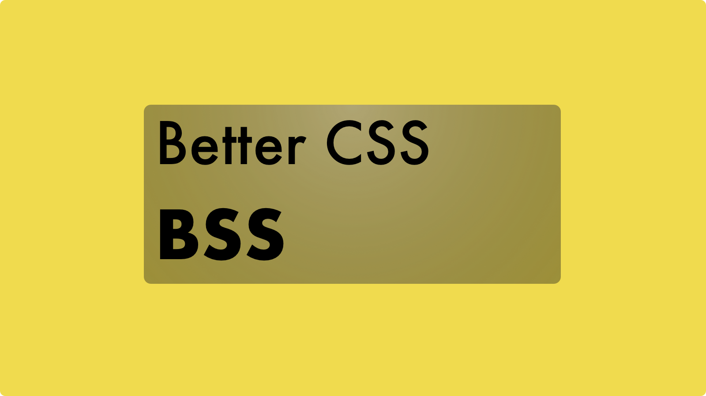

import Link from "$components/Link";
import Quote from "$components/mdx/Quote";




## Motivation

BSS is a stylesheet language that is compiled to CSS by our compiler. It is a superset of CSS. It allows front-end developers to write CSS with **nested style rules, variables, functions, control flow, mathematical operations and inheritance**, features that are take for granted in programming languages but are unfortunately not available in CSS. These features have rich expressive power while allowing front-end developers to write more modular and maintainable CSS code.

Note that the compiler we implement will not attempt to parse CSS (this would be overly ambitious and not necessary). It will only parse BSS language features and compile them into CSS. 

---

## Syntax and Examples

### Nested Style Rules

```css
/* CSS */
div ul { list-style: none; }
div li { display: inline-block; }
div a {
  margin: 3px 5px;
  text-decoration: none;
}
```

```scss
/* BSS */
div {
  ul { list-style: none; }
  li { display: inline-block; }
  a {
    margin: 3px 5px;
    text-decoration: none;
  }
}
```

---

## Variables

```css
/* CSS */
html {
  font: 90% Times New Roman, sans-serif;
  color: #666;
}
```

```scss
/* BSS */
$font-collection: Times New Roman, sans-serif;
$primary-text-color: #666;

html {
  font: 90% $font-collection;
  color: $primary-text-color;
}
```

---

## Functions

```css
/* CSS */
.container {
  -webkit-transform: rotate(60deg);
  -ms-transform: rotate(60deg);
  transform: rotate(60deg);
}
```

```scss
/* BSS */
@func transform($effect) {
  -webkit-transform: $effect;
  -ms-transform: $effect;
  transform: $effect;
}
.container { @call transform(rotate(60deg)); }
```

#### Optional Arguments
```scss
/* BSS */
/* argument is optional */
/* default value is 60deg */
@func transform($effect: 60deg) {
  -webkit-transform: $effect;
  -ms-transform: $effect;
  transform: $effect;
}
.container { @call transform(rotate()); }
```

---

## Control Flow

The `@if` syntax is used as `@if <boolean expression> { ... }`. It controls whether or not the block gets evaluated and emits any CSS styles. A`@if` block can be optionally followed by a `@else` block, and the latter is evaluabled if the `@if` boolean expression evaluates to true.

```css
/* CSS */
.container {
  background-color: #f2ece4;
  color: #036;
}
.dark .container {
  background-color: #6b717f;
  color: #d2e1dd;
}
```

```scss
/* BSS */
$light-background: #f2ece4;
$light-text: #036;
$dark-background: #6b717f;
$dark-text: #d2e1dd;

@func theme($light-theme: true) {
  @if $light-theme {
    background-color: $light-background;
    color: $light-text;
  } @else {
    background-color: $dark-background;
    color: $dark-text;
  }
}

.container {
  @call theme-colors($light-theme: true);
  .dark & {
    @call theme-colors($light-theme: false);
  }
}
```

---

## Mathematical Operations

```css
.box] {
  float: left;
  width: 31.25%;
}
```

```scss
.box {
  float: left;
  width: 300px / 960px * 100%;
}
```

---

## Inheritance

By using `@extend`, you can share a set of CSS properties between one selector and another, which helps keep you stylesheet DRY (Don't Repeat Yourself). In the following example, we will create a series of messaging styles for errors, warnings and successes that all share a set of styles. The shared class emits styles only when it is extended, keeping your compiled CSS code neat and clean.

```css
/* CSS */
.message, .success, .error, .warning {
  border: 2px solid #bbb;
  padding: 20px;
  color: #444;
}

.success {
  background-color: green;
}

.error {
  background-color: red;
}

.warning {
  background-color: yellow;
}
```

```scss
/* BSS */
/* This CSS will print because %message-shared is extended. */
%message-shared {
  border: 2px solid #bbb;
  padding: 20px;
  color: #444;
}

/* This CSS won't print because %equal-heights is never extended. */
%equal-heights {
  display: flex;
  flex-wrap: wrap;
}

.message {
  @extend %message-shared;
}

.success {
  @extend %message-shared;
  background-color: green;
}

.error {
  @extend %message-shared;
  background-color: red;
}

.warning {
  @extend %message-shared;
  background-color: yellow;
}
```