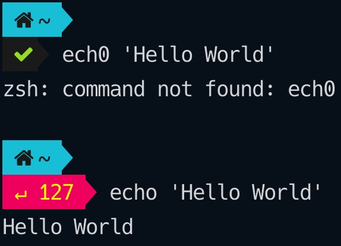

import Link from "$components/Link";
import Quote from "$components/mdx/Quote";


As a developer, I spend a huge amount of time in my terminal doing the following tasks:

- Navigating the file system
- Manipulating files (creating, deleting, reading and updating)
- Executing Git commands
- Running tests
- And more...

I personalize my terminal using a combination of <Link to="https://www.zsh.org/">zsh</Link> 
as well as <Link to="https://https://iterm2.com/">iTerm2</Link>. Zsh is a shell that is very similar to bash, but with <Link to="https://stackabuse.com/zsh-vs-bash/">a few enhancements</Link>. iTerm2 is a terminal emulator for macOS that is much more configurable than the native macOS terminal. Unfortunately, iTerm2 is not available on other operating systems like Linux and Windows.

### Hyper vs iTerm2

Recently I also tried <Link to="https://hyper.is/">Hyper</Link>. Hyper is cross-platform and JavaScript-extensible (a huge plus for JavaScript developers). It also provides a very clean and minimalist look. Unfortunately, it always felt a few milliseconds slower and less responsive than iTerm2. This tiny difference led me to switch back to iTerm2 although I did find Hyper visually more appealing.


<span class="caption">Hyper, an alternative to iTerm2</span>

---

## Zsh

### Installation 

Probably the following 2 steps are not necessary for Catalina users because Catalina uses zsh by default. Older versions of macOS use bash, so it is necessary to install zsh and make it default.

Zsh can be installed through <Link to="https://brew.sh/">Homebrew</Link>. 

```bash
brew install zsh
```

Once installed, you can switch the default shell from bash to zsh with the following command. 

```bash
chsh -s /bin/zsh
```

### Customization

Configuration for zsh is done in the `.zshrc` file located in your home directory (i.e. `~`). Whenever changes are made in `.zshrc` and you'd like to see the changes applied to an already open terminal window, you need to execute the `source ~/.zshrc` command to propagate the changes to the current terminal session. Otherwise, you need to fully quit and restart the terminal in order to see the changes applied.

#### zsh-syntax-highlighting

<Link to="https://github.com/zsh-users/zsh-syntax-highlighting">This package</Link> highlights commands while they are being typed. Invalid commands will be highlighted in red, which helps you catch syntax errors before actually executing the commands.


<span class="caption">Without syntax highlighting</span>


<span class="caption">With syntax highlighting</span>

Install zsh-syntax-highlighting with Homebrew:

```bash
brew install zsh-syntax-highlighting
```

Alternatively, you can install zsh-syntax-highlighting by cloning the package into your home directory:

```bash
git clone https://github.com/zsh-users/zsh-syntax-highlighting.git ~/
```

To enable zsh-syntax-highlighting in the zsh shell, you need to add the following into your `.zshrc`:

```bash
source ./zsh-syntax-highlighting/zsh-syntax-highlighting.zsh
```

More installation options can be found <Link to="https://github.com/zsh-users/zsh-syntax-highlighting/blob/master/INSTALL.md">Here</Link>.

#### zsh-auto-suggestions
With <Link to="https://github.com/zsh-users/zsh-autosuggestions/">this package</Link>, as you type commands, you will see a suggested completion after the cursor in a muted gray color. You can accept the suggestion by pressing the right arrow key. As you type, the suggestion will change dynamically.


<span class="caption">Auto completion and suggestion</span>

Install zsh-auto-suggestions by cloning the package (preferably into `~/.zsh/zsh-autosuggestions`, according to the offical guide):

```bash
git clone https://github.com/zsh-users/zsh-autosuggestions ~/.zsh/zsh-autosuggestions
```

Then add the following into your `.zshrc`:

```bash
source ~/.zsh/zsh-autosuggestions/zsh-autosuggestions.zsh
```

More installation options can be found <Link to="https://github.com/zsh-users/zsh-autosuggestions/blob/master/INSTALL.md">Here</Link>.

#### colorls