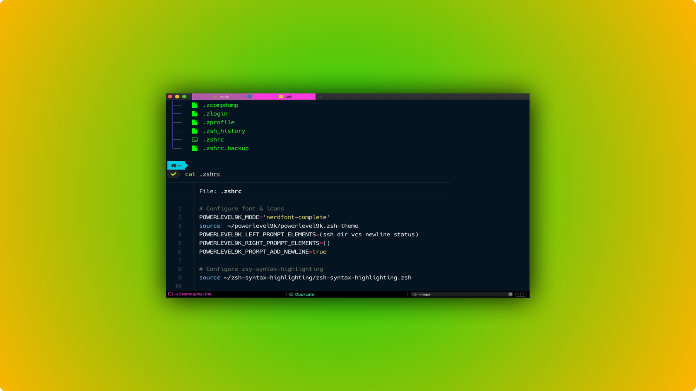

import Link from "$components/Link";
import Quote from "$components/mdx/Quote";



As a developer, I spend a lot of time in my terminal doing the following tasks:

- Navigating the file system
- Manipulating files (creating, deleting, reading and updating)
- Executing Git commands
- Running tests
- And more...

I customize my terminal using a combination of <Link to="https://www.zsh.org/">zsh</Link> 
and <Link to="https://iterm2.com/">iTerm2</Link>. Zsh is a shell that is very similar to bash, but with <Link to="https://stackabuse.com/zsh-vs-bash/">a few enhancements</Link>. iTerm2 is a configurable terminal interface for macOS that replaces the native macOS terminal. Unfortunately, iTerm2 is not available on other platforms like Ubuntu and Windows.

### Aside: Hyper vs iTerm2

Recently I also tried <Link to="https://hyper.is/">Hyper</Link>. Hyper is cross-platform and JavaScript-extensible (a huge plus for JavaScript developers). It also provides a very clean and minimalist look. Unfortunately, it always felt a few milliseconds slower and less responsive than iTerm2. This tiny delay led me to switch back to iTerm2 although I did find Hyper visually more appealing.


<span class="caption">Hyper, an alternative to iTerm2</span>

---

## My configuration files

### `.zshrc`

In the tutorial, I will guide you through every installation step and explain every line of `.zshrc` to you. If you want to reference the complete configuration file, it's available as a <Link to="https://gist.github.com/chuntonggao/6ecce4f2f9ed3238f0d7639c69c2644c">GitHub Gist</Link>. Note that some stuff in this file may not be applicable to you, such as MySQL and Google Cloud configurations. I will explain the relevant stuff in this tutorial.

### `zshColorTheme.json`

This is for color theme configurations and available <Link to="https://gist.github.com/chuntonggao/a490f072209aacbd96b0b07bfffe1759">here</Link>. Again, I will explain the details a bit later.

---
## Homebrew

Before we dive into the actual stuff, if you are a macOS user, I **highly, highly, highly** recommended you to have <Link to="https://brew.sh">Homebrew</Link> installed. Homebrew is an easy-to-use package manager for macOS and will make many installations much much easier.

---

## Zsh

### Install zsh

Probably the following 2 steps are not necessary for Catalina users because macOS switched its default shell from bash to zsh in the Catalina updates. For older macOS versions, however, it is necessary to install zsh and make it the default shell.

Zsh can be installed through <Link to="https://brew.sh/">Homebrew</Link>:

```bash
brew install zsh
```

Once installed, you can set zsh as the default shell with the following command:

```bash
chsh -s /bin/zsh
```

### Configure zsh extensions

Configuration for zsh is done in the `.zshrc` file located in the user's home directory (i.e. `~`). Whenever changes are made in `.zshrc` and you'd like to see the changes applied to an already open terminal session, you need to execute the `source ~/.zshrc` command to propagate the changes to the current terminal session. Otherwise, you need to fully quit and restart the terminal in order to see the changes applied.

#### zsh-syntax-highlighting

<Link to="https://github.com/zsh-users/zsh-syntax-highlighting">This package</Link> highlights commands while they are being typed. Invalid commands will be highlighted in red, which helps you catch syntax errors before executing the commands.


Install zsh-syntax-highlighting with Homebrew:

```bash
brew install zsh-syntax-highlighting
```

Alternatively, you can install zsh-syntax-highlighting by cloning the package into your home directory:

```bash
git clone https://github.com/zsh-users/zsh-syntax-highlighting.git ~/
```

To enable zsh-syntax-highlighting, you need to add the following into your `.zshrc`:

```bash
source ./zsh-syntax-highlighting/zsh-syntax-highlighting.zsh
```

More installation options can be found <Link to="https://github.com/zsh-users/zsh-syntax-highlighting/blob/master/INSTALL.md">here</Link>.

#### zsh-auto-suggestions

With <Link to="https://github.com/zsh-users/zsh-autosuggestions/">this package</Link>, as you type commands, you will see a suggested completion after the cursor in a light gray color. You can accept the suggestion by pressing the right arrow key. As you type, the suggestion will change dynamically.


Install zsh-auto-suggestions by cloning the package (preferably into `~/.zsh/zsh-autosuggestions`, according to the offical guide):

```bash
git clone https://github.com/zsh-users/zsh-autosuggestions ~/.zsh/zsh-autosuggestions
```

Then add the following into your `.zshrc`:

```bash
source ~/.zsh/zsh-autosuggestions/zsh-autosuggestions.zsh
```

More installation options can be found <Link to="https://github.com/zsh-users/zsh-autosuggestions/blob/master/INSTALL.md">here</Link>.

#### colorls

With colorls, you can list your files and folders with style! The screenshot on the right shows the end result.


Installing colorls can be a bit tricky, and I didn't find <Link to="https://github.com/athityakumar/colorls#installation">the official installation guide</Link> particularly helpful when I installed colorls. Here are my recommened installation procedures (which worked for me):

**Step 1:**     
Install Ruby (preferably, version > 2.3) and gem. There are many ways to install Ruby and gem. I installed through <Link to="https://rvm.io/rvm/install">RVM (Ruby Version Manager)</Link>. Make sure you have the executables `ruby` and `gem` (both of which should come from RVM out of the box). Execute the commands `which ruby` and `which gem` to make sure.

**Step 2:**     
Install colorls through gem:

```bash
gem install colorls
```

Now you should be able to execute the `colorls` and see colorized output;

```bash
colorls # you can optionally put flags like:
        # --dirs                  list only directories
        # --files                 list only files
        # --long                  show verbose output
        # --almost-all            show all files and directories
        #                         including dot files but excluding . and ..
        # --tree=2                show tree-like structure with depth = 2
        # for more flags and arguments please visit the colorls documenation
        # https://github.com/athityakumar/colorls#installation
```

**Step 3:**   
colorls also comes with automatic tab completion for file and directory names. You can press the tab key to auto complete. To take advantage of this feature, you need to source the tab_complete executable in your `.zshrc` file. Specifically, first find you ruby version:

```bash
ruby -v
```

In my case, the output is:

```bash
ruby 2.4.0p0 (2016-12-24 revision 57164) [x86_64-darwin18]
```

So my ruby version is `2.4.0`.

Next, find out the version of your colorls:

```bash
colorls -v
```

My output is:

```bash
1.2.0
```

Knowing the version numbers of ruby and colorls, I will put the following line into my `.zshrc`:

```bash
source ~/.rvm/gems/ruby-2.4.0/gems/colorls-1.2.0/lib/tab_complete.sh
# replace the ruby and colorls version numbers with your own
```

Now you should be able to use the tab key to auto complete file and directories paths.

**Step 4:**  

Aliasing is awesome. I often use the following command to list all files in a tree-like structure:

```bash
'colorls --group-directories-first --almost-all --files --tree=1'
```

However, it's cumbersome to type such a long command each and every time. With aliasing, I just need to type `lf`, my own custom command.

I have the following aliases in my `.zshrc`:

```bash
alias l='colorls --group-directories-first --almost-all --tree=1'
alias ll='colorls --group-directories-first --almost-all --long'
alias ld='colorls --group-directories-first --almost-all --dirs --tree=1'
alias lf='colorls --group-directories-first --almost-all --files --tree=1'
alias lt1='colorls --group-directories-first --almost-all --tree=1'
```

Replace them as you see fit and be creative!


### bat for better cat


`cat` is a command in unix-like systems that prints file content onto the terminal. The native `cat` is very ugly because the output is plain, white text without any formatting and highlighting. `bat` stands for `better cat` and does exactly that! You can install with homebrew:

```bash
brew install bat
```

More installation options can be found <Link to="https://github.com/sharkdp/bat">here</Link>.

In fact, `bat` is so much better than `cat` that I almost never use the native `cat` anymore. I created an alias in my `.zshrc`:

```bash
alias cat='bat'
```

### Keep exploring...

The biggest reason I favor zsh over bash is that zsh's ecosystem is so diverse. Above are just some of the plugins that I think are the most essential, but there are <Link to="https://github.com/robbyrussell/oh-my-zsh/wiki/Plugins">tons of plugins</Link> available out there. Some plugins are platform-, language-specific such as plugins for Python, Docker, Visual Studio Code, AWS, etc...

---

## iTerm2

### Install iTerm2

Install iTerm 2 <Link to="https://iterm2.com/">here</Link>.


### Style iTerm2 - powerlevel9k

In order to have the same icons, font and prompt as me, you need to install <Link to="https://github.com/Powerlevel9k/powerlevel9k#installation">powerlevel9k</Link>. You can install by cloning the package into the user's home directory:

```bash
git clone https://github.com/Powerlevel9k/powerlevel9k.git ~/
```

More installation options can be found <Link to="https://github.com/Powerlevel9k/powerlevel9k#installation">here</Link>.

Next, add the following into your `.zshrc` file:

```bash
POWERLEVEL9K_MODE='nerdfont-complete'
source  ~/powerlevel9k/powerlevel9k.zsh-theme
POWERLEVEL9K_LEFT_PROMPT_ELEMENTS=(ssh dir vcs newline status)
POWERLEVEL9K_RIGHT_PROMPT_ELEMENTS=()
POWERLEVEL9K_PROMPT_ADD_NEWLINE=true
```

Then, open your iTerm2 preferences, go to `Profiles -> Text` and then change the font settings. It is important to change the font to `Hack Nerd Font`. Otherwise, the icons will not display properly.


### Style iTerm2 - color theme

There are <Link to="https://github.com/robbyrussell/oh-my-zsh/wiki/Themes">tons of color themes</Link> that you can download.

Alternatively, if you want to use the same theme as me, you can download my theme configuration file `zshColorTheme.json` from <Link to="https://gist.github.com/chuntonggao/a490f072209aacbd96b0b07bfffe1759">my GitHub</Link>. Then, click `Other Actions...` and then `Import JSON Profiles...` in the window shown above, in order to import the configuration file.
